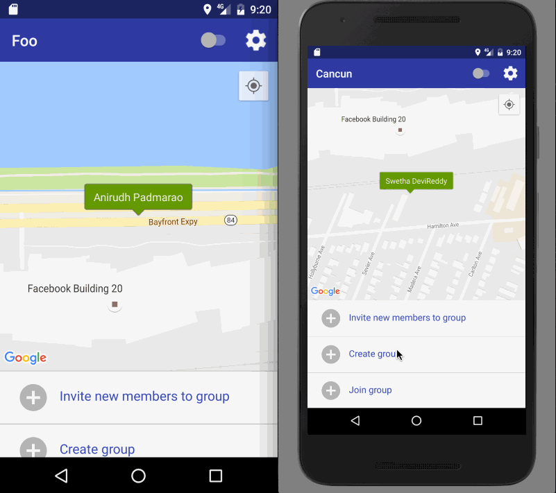

# FindMate

We often visit places/sites and often don't post the location. Sometimes your friend or relative is in the same place and you didn't know about it.
This app helps you in finding your friend/relative if they happen to be in same place at the same time, just by turning on your visibility.

## User Stories

The following **required** functionality is completed:

* [x] The app includes **all required user stories**
* [x] User can **login via Facebook/Twitter**
  * [x] User gets authenticated via FB/Twitter
  * [x] Use **location service**
* [x] Invite Friends
* [x] Create Groups
* [x] Join Groups and Invite to Group
* [x] User publishes location on map

**Optional**
* [ ] User can **search for activities**
  * [x] User can see list of events at near by location
* [ ] User can create events
 * [ ] Events creation include location, type, name, time
* [ ] User can change **settings** in settings menu.
 * [ ] Include settings like location, events etc

